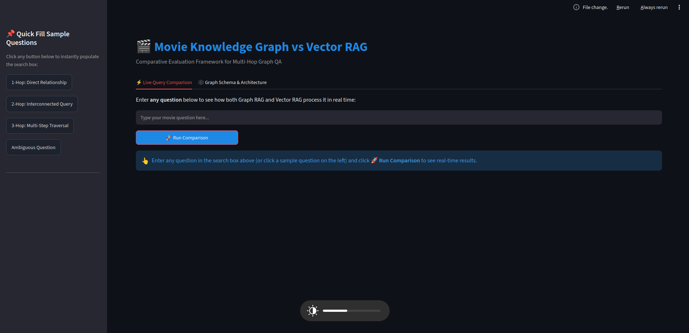
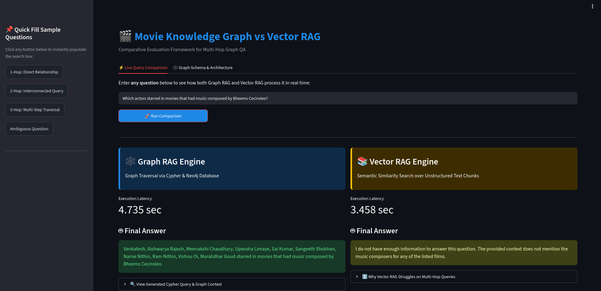
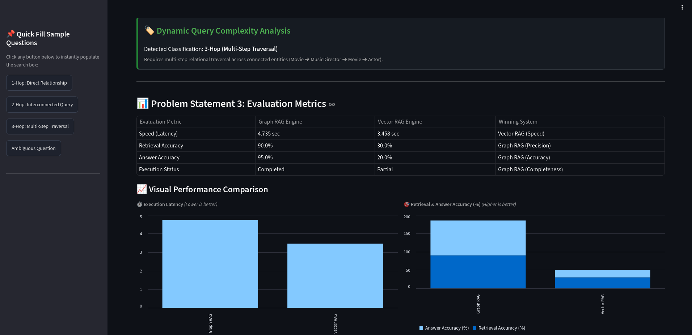
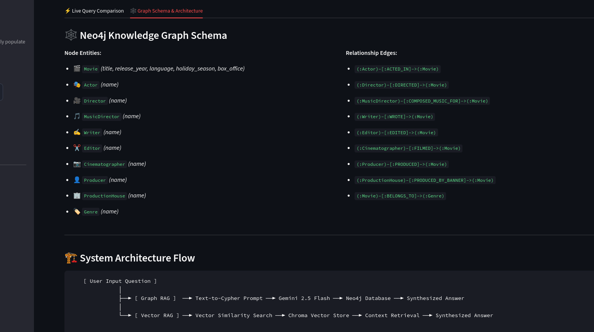
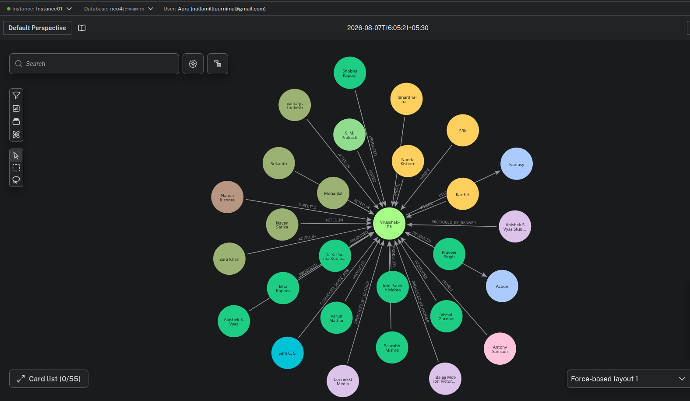
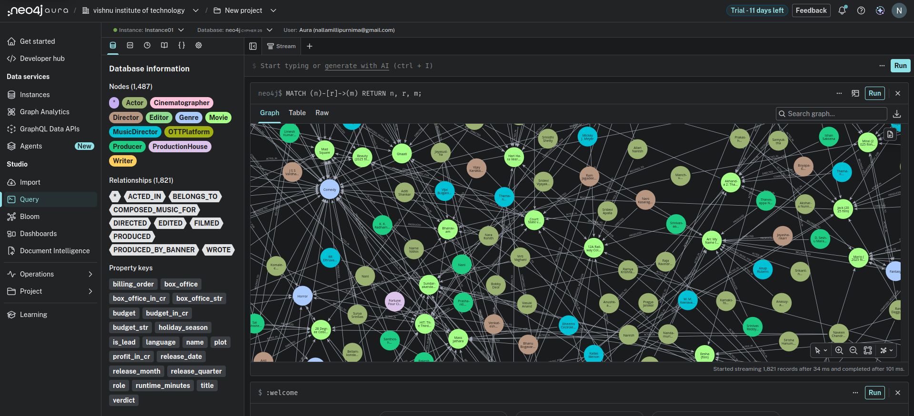

# 🎬 Graph-Based Question Answering System using Graph RAG and Vector RAG

> **A Hybrid Retrieval-Augmented Generation (RAG) system that compares Graph RAG and Vector RAG for answering single-hop and multi-hop movie-related questions using a Neo4j Knowledge Graph and Chroma Vector Database.**

---

# 📖 Project Overview

This project implements a **Hybrid Question Answering System** that compares two Retrieval-Augmented Generation (RAG) techniques over the same Tollywood movie dataset:

- **Graph RAG** using a Neo4j Knowledge Graph
- **Vector RAG** using ChromaDB and semantic embeddings

While Vector RAG retrieves information based on semantic similarity, Graph RAG traverses explicit relationships between entities such as **movies, actors, directors, writers, music directors, producers, genres, production houses, and cinematographers**, enabling more effective multi-hop reasoning.

An interactive **Streamlit dashboard** allows users to execute the same query on both retrieval pipelines, compare their responses, visualize graph structures, and evaluate their performance using multiple benchmark metrics.

---

# 🎯 Assignment Objective

This project was developed as the solution for **Problem Statement 3 – Graph-Based Question Answering System**.

The primary objectives were to:

- Build a structured Knowledge Graph using Neo4j.
- Build a semantic Vector Database using ChromaDB.
- Implement Graph RAG and Vector RAG over the same dataset.
- Compare both retrieval approaches using identical benchmark questions.
- Evaluate retrieval quality, answer accuracy, execution latency, and multi-hop reasoning capability.

---

# ✨ Key Features

### 🕸 Knowledge Graph

- Neo4j Knowledge Graph construction
- Rich graph schema with multiple entity types
- Dynamic Cypher query generation
- Multi-hop graph traversal

### 📚 Vector Retrieval

- Chroma Vector Database
- Google Gemini Embeddings
- Semantic similarity search
- Context-aware response generation

### 🤖 AI Question Answering

- Google Gemini 2.5 Flash
- Graph RAG pipeline
- Vector RAG pipeline
- Automatic query complexity analysis

### 📊 Evaluation

- Side-by-side Graph RAG vs Vector RAG comparison
- Execution latency measurement
- Retrieval quality evaluation
- Interactive charts and visual analytics

### 🖥 User Interface

- Interactive Streamlit dashboard
- Knowledge Graph visualization
- Neo4j graph exploration
- Benchmark question support

---

# 📸 Project Demonstration

## 🏠 Application Home Page

The Streamlit application provides an intuitive interface for submitting movie-related questions and comparing Graph RAG and Vector RAG responses.

<p align="center">

</p>

---

## 🔍 Graph RAG vs Vector RAG Comparison

Both retrieval pipelines execute the same user query, enabling a direct comparison of answer quality, reasoning capability, and execution latency.

<p align="center">

</p>

---

## 📊 Evaluation Metrics

The system evaluates both approaches using benchmark questions and visualizes retrieval accuracy, answer quality, execution time, and completion status.

<p align="center">

</p>

---

## 🕸 Knowledge Graph Schema & System Architecture

This view illustrates the graph schema, supported node labels, relationship types, and the overall architecture of the Hybrid RAG system.

<p align="center">

</p>

---

## 🌐 Neo4j Knowledge Graph Visualization

Visualization of the generated Knowledge Graph, highlighting the relationships between movies and associated entities such as actors, directors, writers, producers, genres, editors, music directors, and cinematographers.

<p align="center">

</p>

---

## 🗄 Neo4j Database Overview

Overview of the populated Neo4j database, including node labels, relationship types, property keys, and graph statistics after data ingestion.

<p align="center">

</p>

---

# 🛠️ Technology Stack

| Category | Technologies |
|----------|--------------|
| **Programming Language** | Python 3.11 |
| **User Interface** | Streamlit |
| **Large Language Model** | Google Gemini 2.5 Flash |
| **Knowledge Graph Database** | Neo4j AuraDB |
| **Vector Database** | ChromaDB |
| **Framework** | LangChain |
| **Embedding Model** | GoogleGenerativeAIEmbeddings |
| **Graph Query Language** | Cypher |
| **Dataset Sources** | Wikipedia, TMDB API |
| **Environment Management** | python-dotenv |
| **Version Control** | Git & GitHub |

---

# 📂 Project Structure

```text
graph-based-question-answering-system/
│
├── app.py                         # Streamlit application
├── README.md                      # Project documentation
├── REPORT.md                      # Technical report
├── requirements.txt               # Project dependencies
├── .env.example                   # Environment variables template
├── .gitignore
│
├── data/
│   ├── movies_dataset.json        # Final processed dataset
│   └── test_questions.json        # Benchmark questions
│
├── scripts/
│   ├── wiki_scrapper.py           # Dataset collection
│   ├── patch_data.py              # Metadata enrichment using TMDB
│   ├── finalize_data.py           # Dataset standardization
│   ├── ingest.py                  # Neo4j graph ingestion
│   ├── ingest_vector.py           # ChromaDB ingestion
│   └── test_conn.py               # Neo4j connection verification
│
├── src/
│   ├── config.py                  # Environment configuration
│   ├── graph_rag.py               # Graph RAG pipeline
│   ├── vector_rag.py              # Vector RAG pipeline
│   └── evaluator.py               # Comparative evaluation
│
└── screenshots/
    ├── home_page.png
    ├── graph_vs_vector_comparison.png
    ├── evaluation_metrics.png
    ├── graph_schema_architecture.png
    ├── neo4j_graph_visualization.png
    └── neo4j_database_overview.png
```

---

# 🏗️ System Architecture

```
                         User Question
                               │
                               ▼
                   Streamlit Web Application
                               │
              ┌────────────────┴────────────────┐
              │                                 │
              ▼                                 ▼
      Graph RAG Pipeline                Vector RAG Pipeline
              │                                 │
      Gemini 2.5 Flash                 Gemini Embeddings
              │                                 │
      Cypher Query Generation          Semantic Similarity Search
              │                                 │
              ▼                                 ▼
     Neo4j Knowledge Graph             Chroma Vector Database
              │                                 │
              └──────────────┬──────────────────┘
                             ▼
                 Comparative Performance Analysis
                             ▼
                    Final Answers & Evaluation
```

---

# 🕸️ Knowledge Graph Design

The Knowledge Graph represents movies as interconnected entities rather than isolated documents. This enables explicit relationship traversal and improves multi-hop reasoning capabilities.

### Node Labels

| Node | Description |
|------|-------------|
| 🎬 Movie | Movie details |
| 🎭 Actor | Cast members |
| 🎥 Director | Film directors |
| 🎵 MusicDirector | Music composers |
| ✍️ Writer | Story & screenplay writers |
| ✂️ Editor | Editors |
| 📷 Cinematographer | Cinematographers |
| 👤 Producer | Producers |
| 🏢 ProductionHouse | Production banners |
| 🎭 Genre | Movie genres |

---

### Relationship Types

| Relationship | Description |
|--------------|-------------|
| ACTED_IN | Actor → Movie |
| DIRECTED | Director → Movie |
| COMPOSED_MUSIC_FOR | Music Director → Movie |
| WROTE | Writer → Movie |
| EDITED | Editor → Movie |
| FILMED | Cinematographer → Movie |
| PRODUCED | Producer → Movie |
| PRODUCED_BY_BANNER | Production House → Movie |
| BELONGS_TO | Movie → Genre |

---

# 🔷 Graph RAG Pipeline

The Graph RAG workflow retrieves structured knowledge by traversing relationships stored inside the Neo4j Knowledge Graph.

### Workflow

1. User submits a natural language question.
2. Gemini 2.5 Flash converts the question into a Cypher query.
3. The Cypher query is executed against Neo4j.
4. Relevant nodes and relationships are retrieved.
5. Gemini synthesizes the retrieved graph information into a natural language response.

### Strengths

- Multi-hop reasoning
- Relationship-aware retrieval
- Explainable graph traversal
- High factual consistency

---

# 📚 Vector RAG Pipeline

The Vector RAG workflow retrieves semantically similar documents from ChromaDB.

### Workflow

1. User submits a question.
2. Gemini Embedding converts the query into vector embeddings.
3. ChromaDB retrieves the most relevant document chunks.
4. Retrieved context is supplied to Gemini 2.5 Flash.
5. Gemini generates the final response.

### Strengths

- Fast semantic retrieval
- Effective document search
- Low retrieval latency

### Limitations

- No explicit relationship traversal
- Reduced performance on complex multi-hop questions
- Limited explainability compared to Graph RAG

---

# ⚙️ Installation & Setup

## 1️⃣ Clone the Repository

```bash
git clone https://github.com/Purnima-nallamilli/graph-based-question-answering-system.git

cd graph-based-question-answering-system
```

---

## 2️⃣ Create a Virtual Environment

### Windows

```bash
python -m venv venv

venv\Scripts\activate
```

### Linux / macOS

```bash
python3 -m venv venv

source venv/bin/activate
```

---

## 3️⃣ Install Dependencies

```bash
pip install -r requirements.txt
```

---

## 4️⃣ Configure Environment Variables

Create a `.env` file in the project root by referring to the provided `.env.example`.

```env
GOOGLE_API_KEY=your_google_api_key

TMDB_API_KEY=your_tmdb_api_key

NEO4J_URI=your_neo4j_uri

NEO4J_USERNAME=neo4j

NEO4J_PASSWORD=your_neo4j_password
```

---

# ▶️ Running the Project

### Step 1 — Verify Neo4j Connection

```bash
python scripts/test_conn.py
```

---

### Step 2 — Build the Knowledge Graph

```bash
python scripts/ingest.py
```

---

### Step 3 — Create the Vector Database

```bash
python scripts/ingest_vector.py
```

---

### Step 4 — Launch the Application

```bash
streamlit run app.py
```

The application will automatically open in your default browser.

---

# 💬 Sample Questions

### 1-Hop

```text
Who directed the movie Game Changer?
```

---

### 2-Hop

```text
Which actors starred in Game Changer, and what other movies feature actor Ram Charan?
```

---

### 3-Hop

```text
Find all directors who directed movies starring actors who have worked with Prabhas in Kalki 2898 AD.
```

---

# 📊 Evaluation Methodology

To ensure a fair comparison, **Graph RAG** and **Vector RAG** are evaluated using the same benchmark dataset.

The evaluation considers the following metrics:

- ✅ Retrieval Accuracy
- ✅ Answer Accuracy
- ✅ Execution Latency
- ✅ Multi-Hop Reasoning Capability
- ✅ Response Completeness

The benchmark dataset contains:

- Single-Hop Questions
- Two-Hop Questions
- Three-Hop Questions

The application also provides interactive visualizations to compare the performance of both retrieval techniques.

---

# 📈 Results & Observations

The experimental results demonstrate the strengths and limitations of both retrieval approaches.

### Graph RAG

- Excellent performance on multi-hop reasoning tasks.
- Relationship-aware retrieval using Neo4j.
- Generates explainable answers through graph traversal.
- Produces highly structured responses for connected entities.

### Vector RAG

- Performs well for direct factual queries.
- Fast semantic retrieval using dense embeddings.
- Effective for document-level similarity search.
- May struggle with complex relational reasoning across multiple entities.

Overall, **Graph RAG consistently provides more accurate responses for relationship-intensive questions**, while **Vector RAG offers efficient semantic retrieval for straightforward information retrieval tasks**.

---

# 🚀 Future Enhancements

Possible future improvements include:

- Hybrid Graph + Vector Retrieval
- Support for larger movie datasets
- Real-time dataset updates
- Docker-based deployment
- Cloud deployment (AWS / Azure / GCP)
- Conversational multi-turn question answering
- Advanced evaluation metrics (Precision@K, Recall@K, F1-score)
- Graph visualization enhancements
- User authentication and history tracking

---

# 📚 Learning Outcomes

This project provided practical experience with:

- Knowledge Graph Modeling
- Neo4j Graph Database
- Cypher Query Language
- Retrieval-Augmented Generation (RAG)
- Graph RAG
- Vector RAG
- Semantic Search
- LangChain
- Google Gemini APIs
- ChromaDB
- Streamlit Application Development
- Comparative Evaluation of AI Retrieval Systems

---

# 🤝 Acknowledgements

This project was developed as part of an AI Internship Technical Assessment.

Special thanks to the teams behind:

- Neo4j
- LangChain
- Google Gemini
- ChromaDB
- Streamlit
- TMDB
- Wikipedia

for providing the technologies and data sources used throughout this project.

---

# 👩‍💻 Author

**Purnima Nallamilli**

B.Tech – Information Technology

GitHub: https://github.com/Purnima-nallamilli

LinkedIn: *(Add your LinkedIn profile URL here)*

---

# ⭐ Support

If you found this project useful or interesting, consider giving the repository a ⭐ on GitHub.
